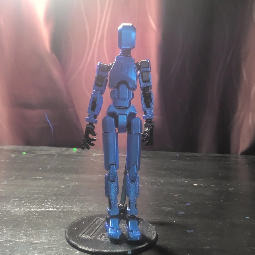
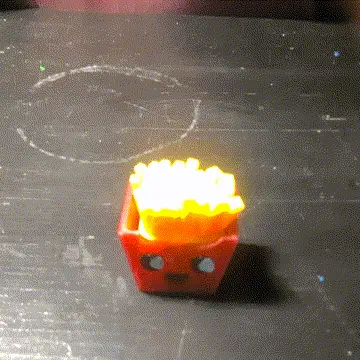
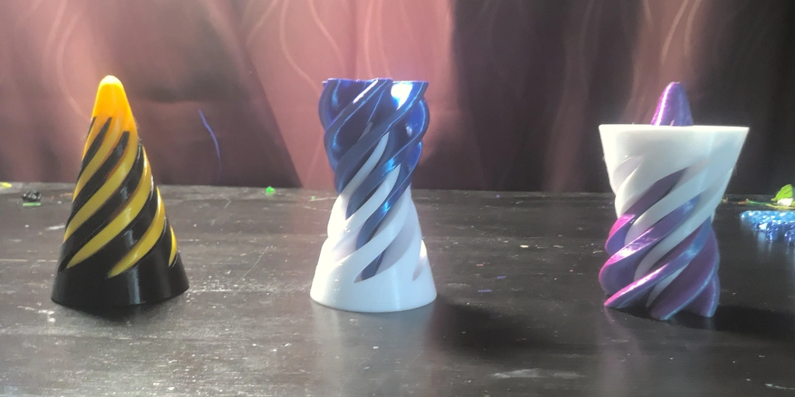
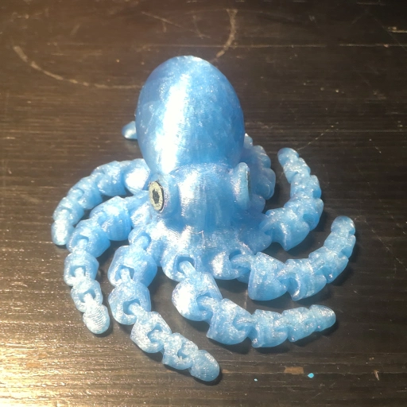
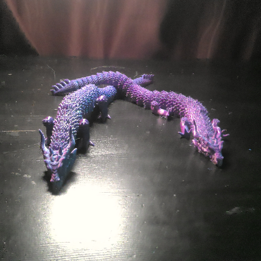

# Print Shop Showcase

Welcome to our print‑shop website! Here is a selection of our 3D‑printable products.

## Dummy 13

This ball‑jointed action figure is simple to assemble and is only 22 steps. If that sounds like too much work, try our pre‑assembled Dummy 13.

[Dummy 13 Version 1.0](https://www.printables.com/model/981111-dummy-13-version-10) by [Lucky 13 Toys](https://www.lucky13toys.com/) is licensed under the [Creative Commons Attribution 4.0](https://creativecommons.org/licenses/by/4.0/) license·
[Download PDF](assets/dummy-13-v1_0-assembly-guide.pdf)

## Fries Clicker

This box of fries isn’t just cute. It makes a super satisfying click sound when squeezed! (Note: not edible)

Model link: [Clicky toonish box of fries](https://makerworld.com/en/models/1231254-clicky-toonish-box-of-fries-no-ams)

## Passthrough Fidget Toy

This passthrough fidget toy seems impossible! No matter what direction you put the pieces together, the parts will go all the way through!

[Ultra Durable Cone Fidget Passthrough Spiral Toy](https://www.thingiverse.com/thing:6944555)
by [TechMagic3D](https://www.thingiverse.com/TechMagic3D) is licensed under the [Creative Commons - Attribution - Share Alike](https://creativecommons.org/licenses/by-sa/3.0/) license.

## Mini Octopus

This cute little octopus comes in many colors and also has moving legs! (No assembly needed)

[Mini Octopus Remix with realistic head](https://www.thingiverse.com/thing:5355885)
by [MBD_3D](https://www.thingiverse.com/MBD_3D) is licensed under the [Creative Commons - Attribution](https://creativecommons.org/licenses/by/4.0/) license.

## Standing Articulated Dragon

This dragon either comes in a combination of blue and green or a combination of blue and purple. You can pose it into many positions and even make it stand!

[Standing Articulated Nature Dragon](https://makerworld.com/en/models/653852-standing-articulated-nature-dragon?from=search#profileId-580727)
by [mattprints](https://makerworld.com/en/@user_2646672671) is lisenced under the [Creative Commons - Attribution](https://creativecommons.org/licenses/by/4.0/) license.

---

© 2025 Slime and printed fun. All rights reserved.
