# Print Shop

Welcome to our website! Here is a selection of our 3D‑printed products.

## Extending Ice Cream
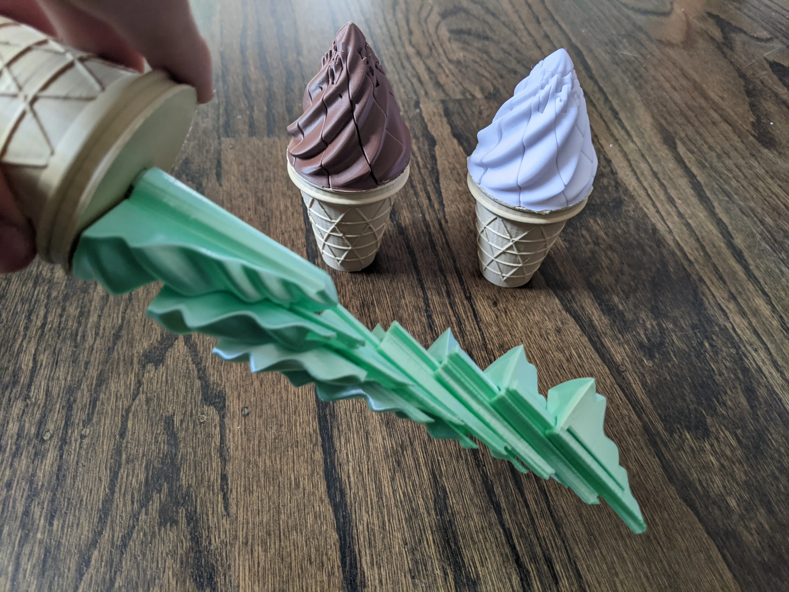

This fun toy looks like an ice cream but extends very far.

This model was deigned by me! Link: [Twisty Ice Cream](https://makerworld.com/models/3326199)

## Dummy 13
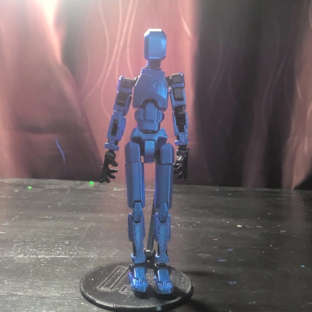

This ball‑jointed action figure is simple to assemble and is only 22 steps. If that sounds like too much work, try our pre‑assembled Dummy 13.

[Dummy 13 Version 1.0](https://www.printables.com/model/981111) by [Lucky 13 Toys](https://www.lucky13toys.com/) is licensed under the [Creative Commons Attribution 4.0](https://creativecommons.org/licenses/by/4.0/) license

[Assembly guide](assets/dummy-13-v1_0-assembly-guide.pdf)

## Fries Clicker
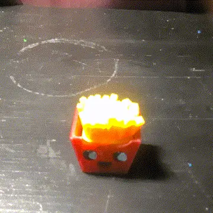

This box of fries isn’t just cute. It makes a super satisfying click sound when squeezed! (Note: not edible)

Model link: [Clicky toonish box of fries](https://makerworld.com/models/1231254)

## Passthrough Fidget Toy
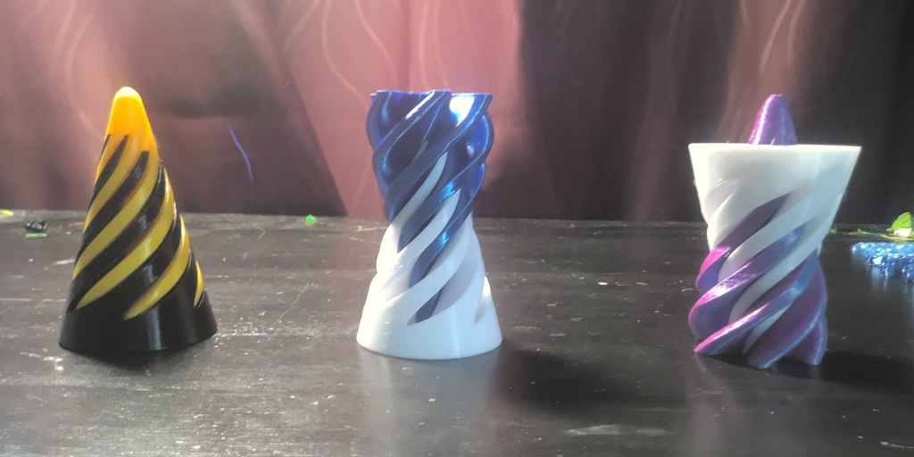

This passthrough fidget toy seems impossible! No matter what direction you put the pieces together, the parts will go all the way through!

[Ultra Durable Cone Fidget Passthrough Spiral Toy](https://www.thingiverse.com/thing:6944555)
by [TechMagic3D](https://www.thingiverse.com/TechMagic3D) is licensed under the [Creative Commons - Attribution - Share Alike](https://creativecommons.org/licenses/by-sa/4.0/) license.

## Mini Octopus
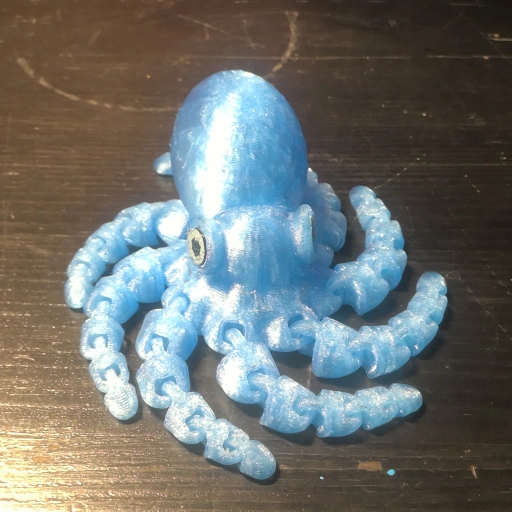

This cute little octopus comes in many colors and also has moving legs! (No assembly needed)

[Mini Octopus Remix with realistic head](https://www.thingiverse.com/thing:5355885)
by [MBD_3D](https://www.thingiverse.com/MBD_3D) is licensed under the [Creative Commons - Attribution](https://creativecommons.org/licenses/by/4.0/) license.

## Articulated Crystal Dragon
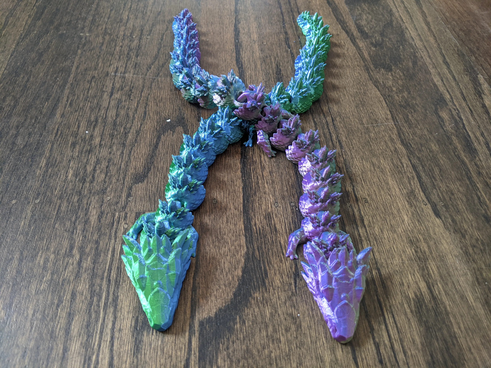

This crystal dragon comes in many colors. You can pose it into many positions!

[Crystal Spine Flexi Dragon - Dragon Fidget Toy](https://makerworld.com/models/2528585)
by [3DGenesix](https://makerworld.com/en/@3DGenesix) is licensed under the [Creative Commons - Attribution - Share Alike](https://creativecommons.org/licenses/by-sa/4.0/) license.

## Twisty Dragon Egg
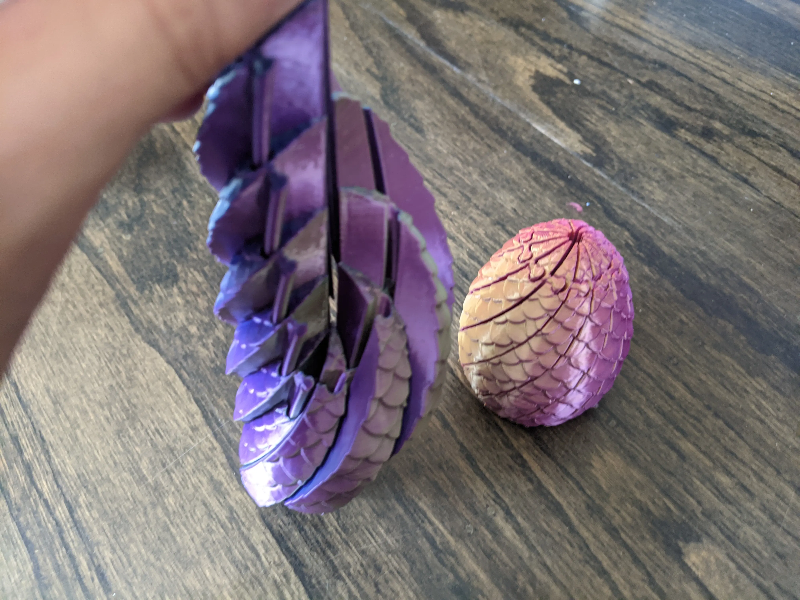

This dragon egg comes in many colors and changes as you lift a piece.

Model link: [Twisty Dragon egg](https://makerworld.com/models/2917945)

## Hexagon Fidget
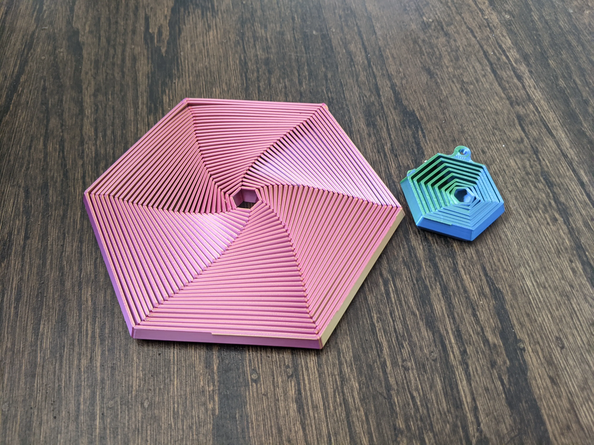

These colorful fidgets come in two sizes. You can put the inner hexagons into many positions.

Link to smaller hexagon: [fidget hexagon key chain](https://makerworld.com/models/1927001)
Link to larger hexagon: [Free to Sell Hexagon Fidget](https://makerworld.com/models/2856433)

## Gyroscope Fidget
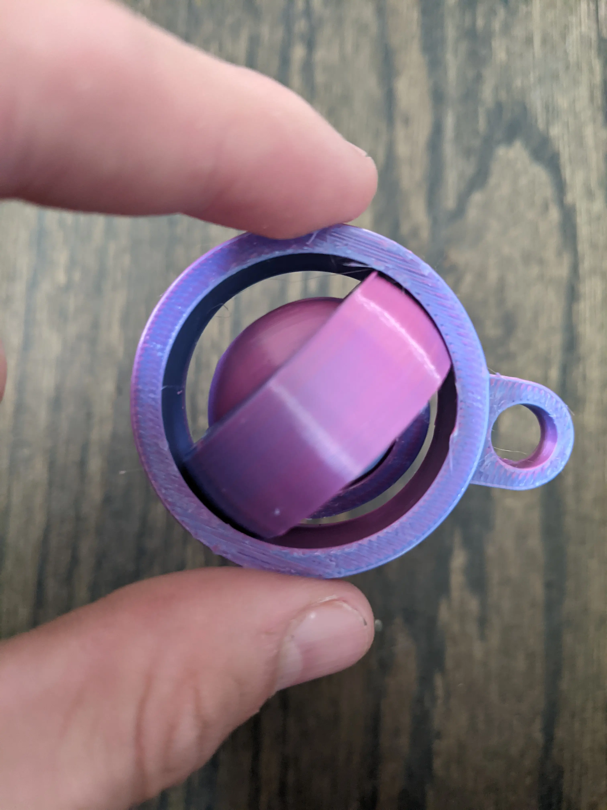

This fidget has many rings that spin around independently.

[Gyro Fidget Spinner](https://www.printables.com/model/157347)
by [Maker Lessons](https://www.printables.com/@MakerLessons_238291) is licensed under the [Creative Commons - Attribution](https://creativecommons.org/licenses/by/4.0/) license.

## Infinity Cube
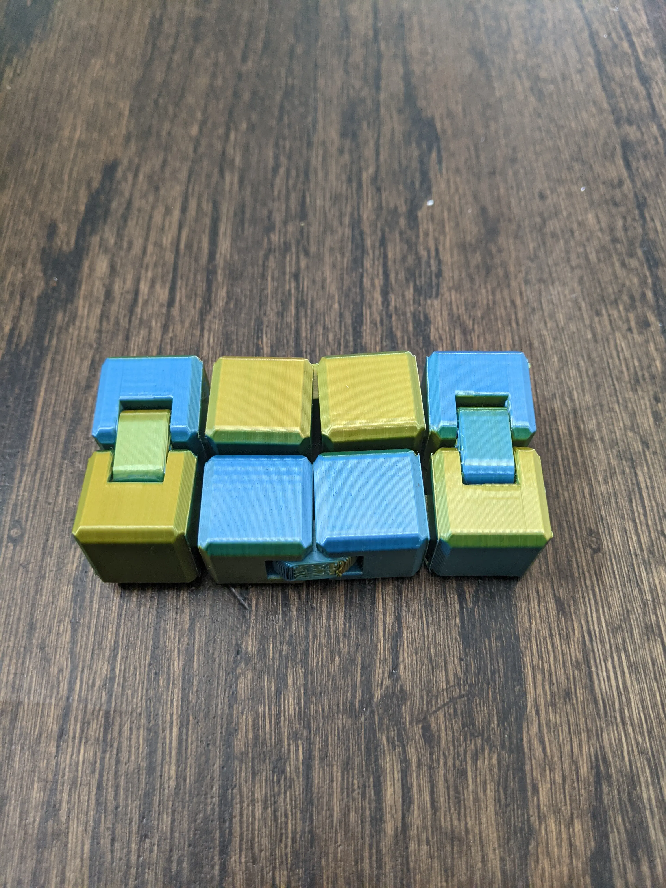

No matter how many times you turn the pieces, you can always tturn it back into a cube!

Model Link: [Sturdy Infinity Cube](https://makerworld.com/models/21188)

## Squishy Cube
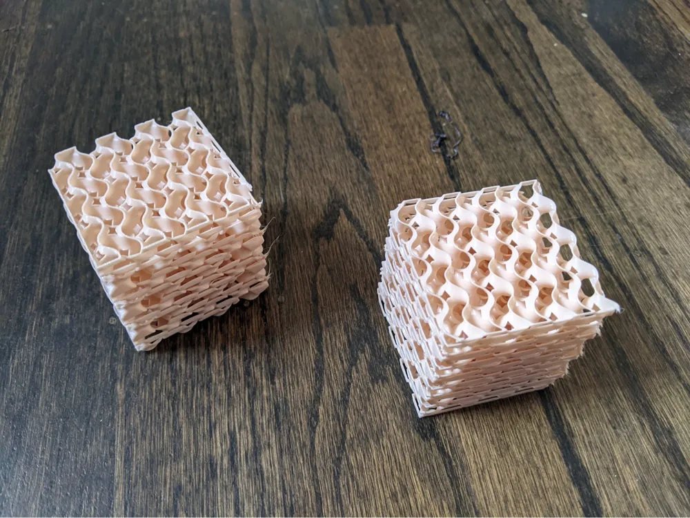

This fun toy can be squished from any side and will expand back to a cube! (see video in link)

This model was deigned by me! Link: [Free to sell TPU squishy cube](https://makerworld.com/models/3241928)

---

© 2025 Slime and printed fun. All rights reserved.
